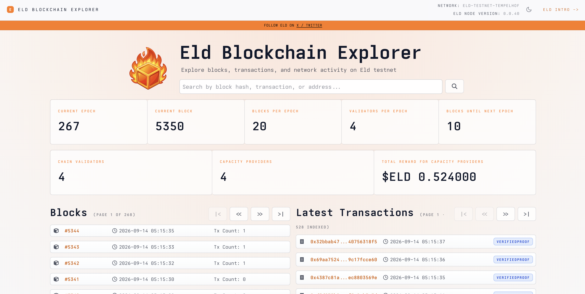

# Eld Blockchain Explorer


[](LICENSE)
[](https://github.com/eldnetwork/eld-blockchain-explorer/actions/workflows/ci.yml)
[](https://explorer.eld.network)
[](https://github.com/eldnetwork/eld-blockchain-explorer/stargazers)

Eld Blockchain Explorer is the public block explorer UI for the [Eld](https://www.eld.network) decentralized ephemeral storage protocol, built with [Vite](https://vitejs.dev/) and React.

**Live site:** [https://explorer.eld.network](https://explorer.eld.network)



## Disclaimer

This repository is the **explorer frontend only** — not the Eld protocol, consensus node, indexer, SDKs, or a wallet.

- It reads public RPC and indexer HTTP APIs; it does not custody keys or submit transactions.
- Displayed chain data depends on those backends and may be incomplete, delayed, or wrong.
- The UI uses **capacity provider** as the product term for that role.
- For protocol docs and the marketing site, see [Documentation](https://docs.eld.network) and [eld.network](https://www.eld.network).

## Architecture

```text
Browser (React SPA)
  └─ App → ExplorerAppShell → AppRoutes → pages/
       ├─ api/            shared RPC + indexer HTTP (timeout, abort)
       ├─ hooks/          data hooks built on api/
       ├─ components/     shared UI (lists, shell, footer, …)
       ├─ utils/          search resolver, formatting, helpers
       └─ config/         RPC_URL, API_URL, feature flags
              │
              ├─ VITE_RPC_URL  → Tendermint / node RPC
              └─ VITE_API_URL  → explorer / indexer API
```

| Layer                                | Role                                                              |
| ------------------------------------ | ----------------------------------------------------------------- |
| `src/App.js`                         | `BrowserRouter` entry                                             |
| `src/components/ExplorerAppShell.js` | chrome (header, theme, footer)                                    |
| `src/AppRoutes.js`                   | client-side routes (+ error boundary, 404)                        |
| `src/pages/`                         | route screens (home, block, tx, account, validators, pinboard, …) |
| `src/api/`                           | typed HTTP helpers for RPC and indexer                            |
| `src/hooks/`                         | data hooks (retry + AbortController) using `src/api/`             |
| `src/config/`                        | env-backed endpoints and optional validator admin status maps     |

Static output is a Vite `build/` folder; deploy that behind any static host / CDN.

## Prerequisites

- [Node.js](https://nodejs.org/) >= 20

## Local development

```bash
npm install
cp .env.example .env.development
cp .env.example .env.production
npm start
```

Dev server: [http://localhost:3000](http://localhost:3000). Vite loads `.env.development` for `npm start` / `npm run dev`.

Calling production RPC/API hosts from `localhost` may fail CORS; use local backends, Vite’s `/rpc` and `/api` proxies, or an allowlisted origin.

### Environment variables

| Variable                             | Required | Description                                                                         |
| ------------------------------------ | -------- | ----------------------------------------------------------------------------------- |
| `VITE_RPC_URL`                       | yes      | Tendermint / node RPC base URL (default `http://localhost:26657`)                   |
| `VITE_API_URL`                       | yes      | Explorer / indexer API base URL (default `http://localhost:9001`)                   |
| `VITE_ENABLE_VALIDATOR_ADMIN_STATUS` | no       | `true` to load optional per-validator admin status URLs (dev-oriented; default off) |

Optional admin-status URL maps (only when the flag is enabled):

```bash
cp src/config/validator-admin-status-urls.development.json.example \
   src/config/validator-admin-status-urls.development.json
cp src/config/validator-admin-status-urls.production.json.example \
   src/config/validator-admin-status-urls.production.json
```

## Scripts

| Script                      | Description                                                                           |
| --------------------------- | ------------------------------------------------------------------------------------- |
| `npm start` / `npm run dev` | Vite dev server                                                                       |
| `npm run build`             | Production build → `build/`                                                           |
| `npm run preview`           | Serve the production build locally                                                    |
| `npm test`                  | Vitest (single run)                                                                   |
| `npm run test:watch`        | Vitest watch mode                                                                     |
| `npm run lint`              | ESLint                                                                                |
| `npm run format`            | Prettier write                                                                        |
| `npm run format:check`      | Prettier check                                                                        |
| `npm run ci`                | `format:check` → `lint` → tests → `npm audit --omit=dev --audit-level=high` → `build` |

```bash
npm run ci
```

## Links

- [Documentation](https://docs.eld.network)
- [Marketing site](https://www.eld.network)
- [X / Twitter](https://x.com/eld_network)

## License

MIT — see [LICENSE](LICENSE).

Font files in `src/fonts/` are [Ioskeley Mono](https://github.com/ahatem/IoskeleyMono), licensed under the SIL Open Font License 1.1 — see [src/fonts/LICENSE](src/fonts/LICENSE).
